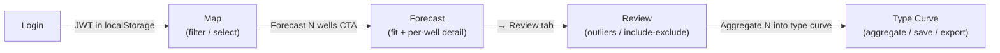

# Architecture

## System diagram

```mermaid
flowchart LR
  user["Browser<br/>(MapLibre + React + SVG charts)"]
  fe["Vite dev server<br/>:5173"]
  be["FastAPI<br/>:8000<br/>(JWT-protected)"]
  pg[("Postgres 16<br/>+ PostGIS<br/>+ TimescaleDB")]
  pmtiles[(infra/basemap/<br/>permian.pmtiles)]
  protomaps[["build.protomaps.com<br/>(daily build, one-time fetch)"]]
  enverus[["Enverus<br/>Prism + DI Direct"]]
  cli["app.cli.create_user<br/>(bootstrap)"]
  seed["app.seed.seed_synthetic<br/>(or seed_county for real)"]
  backup["infra/backup<br/>(pg_dump → .sql.gz)"]

  user -->|login → JWT| be
  user -->|Bearer-auth /api/*| fe
  fe -->|/api proxy| be
  be -->|SQLAlchemy / psycopg| pg
  be -->|HTTP range reads| pmtiles
  enverus -->|httpx pulls<br/>(scheduler + on-demand)| be
  protomaps -.->|infra/basemap/fetch.sh| pmtiles
  cli -.->|bcrypt user row| pg
  seed -.->|wells + production + survey| pg
  pg -.->|nightly pg_dump| backup

  classDef external fill:#fef3c7,stroke:#d97706;
  class enverus,protomaps external;
```

## Frontend page flow



## Decline forecasting flow

```mermaid
flowchart TD
  prod["production_monthly<br/>(rate_calday_*)"]
  peak["peak_detection<br/>(3-mo rolling max,<br/>tied-max ⇒ highest actual rate)"]
  fit["fit_rate_cum<br/>(scipy.optimize.curve_fit,<br/>bounds Di∈[0.3,5], b∈[0.7,1.5])"]
  result["forecasts row<br/>(qi, Di, b, Df, EUR, R², fit_at_bound)"]

  prod --> peak --> fit --> result
  fit -.->|manual override<br/>via PATCH /api/forecasts/{id}| result
```

## Type-curve aggregation

```mermaid
flowchart TD
  fc["forecasts<br/>(per-well peak_month)"]
  pm["production_monthly<br/>(rate_calday_*)"]
  loader["app.type_curves.loader<br/>(slice from first_prod OR peak)"]
  agg["aggregate.py<br/>(percentiles + mean + well_count,<br/>per-1000-ft normalized)"]
  saved["type_curves row<br/>(series JSONB + filter_spec snapshot)"]
  zip["ZIP export<br/>(oil_rates.csv / gas / water / metadata)"]

  fc --> loader
  pm --> loader
  loader --> agg --> saved
  saved -.->|GET /api/type-curves/{id}/export| zip
```

## Why these choices

- **TimescaleDB hypertable on `production_monthly`** — Permian operators
  generate ~10M monthly-prod rows over a ten-year window. Hypertable
  partitioning by `prod_date` keeps per-well queries fast.
- **PostGIS + GIST on `sh_geom` / `bh_geom` / `wellstick`** — required for
  bbox/lasso queries on the map at interactive latency.
- **Self-hosted Protomaps PMTiles** — no API token, no per-tile billing,
  airgap-friendly. One-time ~150–250 MB download, range-served by the
  backend; unprotected so the MapLibre tile fetcher works without an
  Authorization header (which it can't attach anyway).
- **`rate_calday_*` everywhere except month-1** — Enverus `producing_days`
  is unreliable past month 1; calendar-day normalization yields stable
  type curves. Month-1 partial-month rule keeps producing-days as the
  denominator when the well started late in the calendar month.
- **First-prod-month type-curve alignment by default** — includes 1–3
  months of ramp-up, which matters for cash-flow and DCF modeling. Peak
  alignment available as a per-curve option for pure decline analysis.
- **JWT bearer auth on every /api/* route except health/auth/basemap** —
  basemap stays public because the MapLibre tile loader can't attach an
  Authorization header; health stays public so the login-page badge
  renders before auth; auth obviously must accept unauthenticated POSTs.

## API surface

| Method | Path                                | Purpose                              | Auth |
| ------ | ----------------------------------- | ------------------------------------ | ---- |
| GET    | `/api/health`                       | Liveness probe                       | —    |
| POST   | `/api/auth/login`                   | Issue JWT                            | —    |
| POST   | `/api/auth/logout`                  | No-op server side                    | ✓    |
| GET    | `/api/auth/me`                      | Current user                         | ✓    |
| GET    | `/api/basemap/permian.pmtiles`      | Range-served PMTiles                 | —    |
| GET    | `/api/basemap/plss_tx_nm.geojson`   | PLSS overlay                         | —    |
| GET    | `/api/wells/tiles/{z}/{x}/{y}.mvt`  | Filtered MVT tiles                   | ✓    |
| GET    | `/api/wells/{api14}`                | Well detail                          | ✓    |
| GET    | `/api/wells/filters/operators`      | Operator type-ahead                  | ✓    |
| GET    | `/api/wells/filters/facets`         | Filter facets                        | ✓    |
| POST   | `/api/wells/select`                 | Spatial selection + summary          | ✓    |
| POST   | `/api/wells/summary`                | Summary for an api14 list            | ✓    |
| POST   | `/api/sync/run`                     | Kick off Enverus sync                | ✓    |
| GET    | `/api/sync/status`                  | Sync job status                      | ✓    |
| POST   | `/api/forecasts/batch`              | Batch fit                            | ✓    |
| GET    | `/api/forecasts`                    | List forecasts (+ well attrs)        | ✓    |
| GET    | `/api/forecasts/{id}`               | Single forecast                      | ✓    |
| PATCH  | `/api/forecasts/{id}`               | Manual override                      | ✓    |
| GET    | `/api/forecasts/{api14}/curves`     | History + forecast curves            | ✓    |
| POST   | `/api/forecasts/preview`            | Live-edit preview                    | ✓    |
| POST   | `/api/type-curves/compute`          | Live aggregation (no save)           | ✓    |
| POST   | `/api/type-curves`                  | Save type curve                      | ✓    |
| POST   | `/api/type-curves/{id}/versions`    | Save as new version                  | ✓    |
| GET    | `/api/type-curves`                  | Library list                         | ✓    |
| GET    | `/api/type-curves/{id}`             | Single curve (incl. series)          | ✓    |
| PATCH  | `/api/type-curves/{id}`             | Rename / re-notes                    | ✓    |
| DELETE | `/api/type-curves/{id}`             | Delete                               | ✓    |
| GET    | `/api/type-curves/{id}/export`      | ZIP CSV download                     | ✓    |
