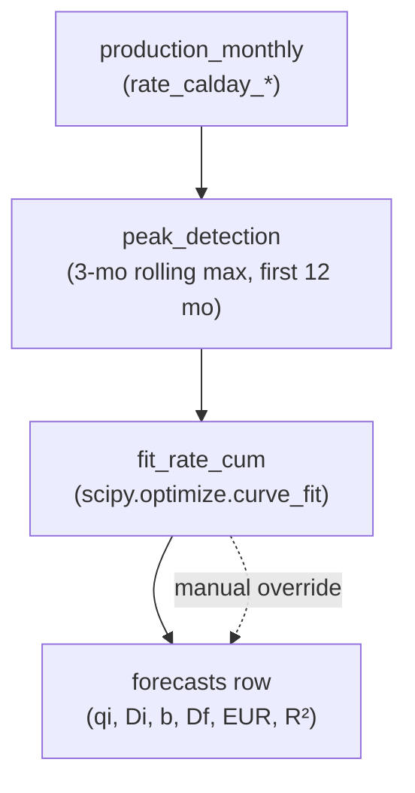

# Architecture

## System diagram

```mermaid
flowchart LR
  user["Browser<br/>(MapLibre + React)"]
  fe["Vite dev server<br/>:5173"]
  be["FastAPI<br/>:8000"]
  pg[("Postgres 16<br/>+ PostGIS<br/>+ TimescaleDB")]
  pmtiles[(infra/basemap/<br/>permian.pmtiles)]
  protomaps[["build.protomaps.com<br/>(daily build, one-time fetch)"]]
  enverus[["Enverus<br/>Prism + DI Direct"]]

  user -->|HTTP / SSE| fe
  fe -->|/api proxy| be
  be -->|SQLAlchemy / asyncpg| pg
  be -->|HTTP range reads| pmtiles
  enverus -->|httpx pulls<br/>(scheduler + on-demand)| be
  protomaps -.->|infra/basemap/fetch.sh| pmtiles

  classDef external fill:#fef3c7,stroke:#d97706;
  class enverus,protomaps external;
```

## Decline forecasting flow (target, step 4)



## Why these choices

- **TimescaleDB hypertable on `production_monthly`** — Permian operators
  generate ~10M monthly-prod rows over a ten-year window. Hypertable
  partitioning by `prod_date` keeps per-well queries (`WHERE api14 = ?`)
  fast and bulk-loads efficient. Plain Postgres would work but degrades
  noticeably past a few million rows.
- **PostGIS + GIST on `sh_geom` / `bh_geom` / `wellstick`** — required for
  bbox/lasso queries on the map at interactive latency.
- **Self-hosted Protomaps PMTiles** — no API token, no per-tile billing,
  airgap-friendly. Cost: one-time ~150–250 MB download, range-served from
  the backend.
- **`rate_calday_*` everywhere except month-1** — Enverus `producing_days`
  is unreliable past month 1; calendar-day normalization yields stable
  type curves. Month-1 keeps producing-days to avoid understating IP.
- **Heel point cached on well header** — computed once during sync from
  the directional survey (first station with inclination ≥ 80°). Avoids
  re-scanning surveys on every map render.

## API surface (target)

See top-level brief; step 1 ships only:

| Method | Path                            | Purpose                          |
| ------ | ------------------------------- | -------------------------------- |
| GET    | `/api/health`                   | Liveness probe                   |
| GET    | `/api/basemap/permian.pmtiles`  | Range-served PMTiles basemap     |
| HEAD   | `/api/basemap/permian.pmtiles`  | Size probe (used by frontend)    |
